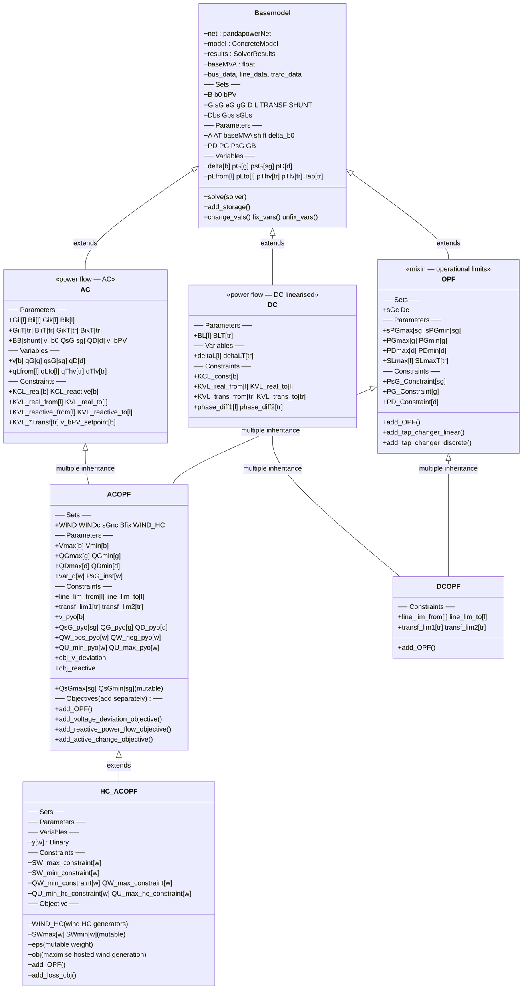
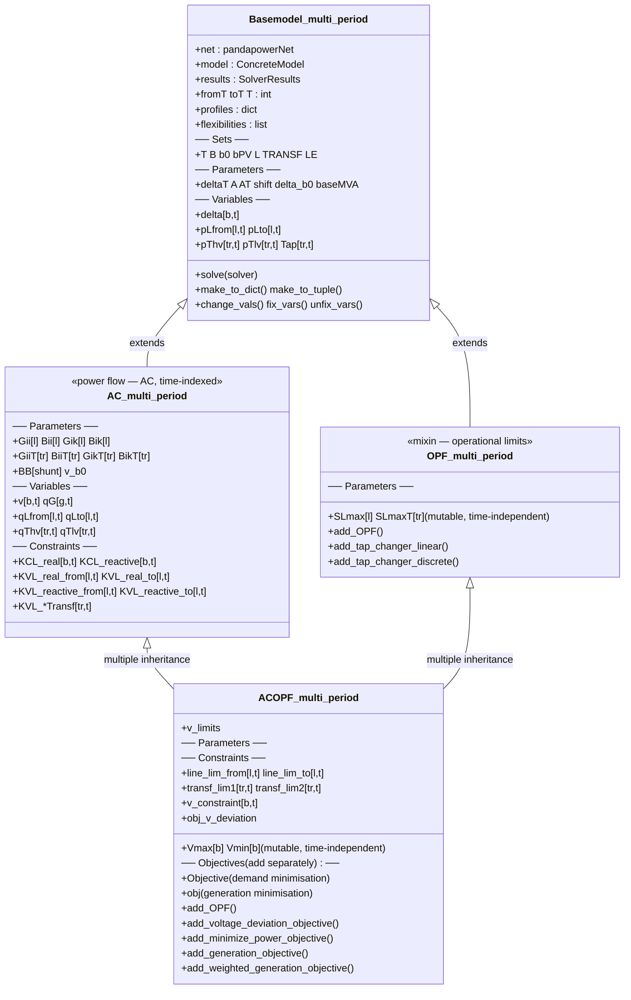
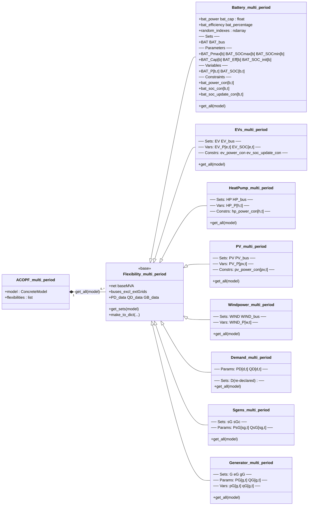

# Class Architecture

This page describes how `potpourri`'s classes relate to each other, what Pyomo
components each layer contributes, and how the model state changes as you
compose or extend classes.  All power quantities live in the **per-unit system**
on `net.sn_mva` (=`model.baseMVA`).

---

## Single-Period Models

### Inheritance diagram



> **Multiple inheritance** — `ACOPF` inherits from both `AC` and `OPF` using Python's
> MRO.  `Basemodel` is the common root so `model` and `net` are never duplicated.
> The same pattern applies to `DCOPF(DC, OPF)`.

---

### Pyomo components at each layer

The table below lists **every Pyomo component** (Set, Param, Var, Constraint,
Objective) that is introduced at each class level.  Lower classes inherit
everything listed above them.

| Layer | Sets | Parameters | Variables | Constraints | Objectives |
|---|---|---|---|---|---|
| **Basemodel** | `B` `b0` `bPV` `G` `sG` `eG` `gG` `D` `L` `TRANSF` `SHUNT` `STOR` | `A` `AT` `baseMVA` `shift` `delta_b0` `PD` `PG` `PsG` `GB` | `delta[b]` `pG[g]` `psG[sg]` `pD[d]` `pLfrom[l]` `pLto[l]` `pThv[tr]` `pTlv[tr]` `Tap[tr]` | — | — |
| **+AC** | — | `Gii` `Bii` `Gik` `Bik` `GiiT` `BiiT` `GikT` `BikT` `BB` `QD` `QsG` `v_b0` `v_bPV` | `v[b]` `qG[g]` `qsG[sg]` `qD[d]` `qLfrom[l]` `qLto[l]` `qThv[tr]` `qTlv[tr]` | `KCL_real[b]` `KCL_reactive[b]` `KVL_real_from/to[l]` `KVL_reactive_from/to[l]` `KVL_*Transf[tr]` `v_bPV_setpoint[b]` | — |
| **+DC** | — | `BL[l]` `BLT[tr]` | `deltaL[l]` `deltaLT[tr]` | `KCL_const[b]` `KVL_real_from/to[l]` `KVL_trans_from/to[tr]` `phase_diff1[l]` `phase_diff2[tr]` | — |
| **+OPF** | `sGc` `Dc` | `sPGmax` `sPGmin` `PGmax` `PGmin` `PDmax` `PDmin` `SLmax[l]` `SLmaxT[tr]` | — | `PsG_Constraint[sg]` `PG_Constraint[g]` `PD_Constraint[d]` | — |
| **ACOPF = AC+OPF** | `WIND` `WINDc` `sGnc` `Bfix` `WIND_HC` | `Vmax[b]` `Vmin[b]` `QGmax` `QGmin` `QsGmax` `QsGmin` `QDmax` `QDmin` `var_q` `PsG_inst` | — | `line_lim_from/to[l]` `transf_lim1/2[tr]` `v_pyo[b]` `QsG_pyo[sg]` `QG_pyo[g]` `QD_pyo[d]` `QW_*_pyo[w]` `QU_*_pyo[w]` | `obj_v_deviation` `obj_reactive` |
| **DCOPF = DC+OPF** | — | — | — | `line_lim_from/to[l]` `transf_lim1/2[tr]` | — |
| **HC_ACOPF ⊂ ACOPF** | `WIND_HC` | `SWmax[w]` `SWmin[w]` `eps` | `y[w]` (binary) | `SW_max/min_constraint[w]` `QW_min/max_constraint[w]` `QU_min/max_hc_constraint[w]` | `obj` (maximise HC) |

---

### Choosing between single-period models

| Goal | Class to use | Key components gained |
|---|---|---|
| Power flow only, full AC equations | `AC` | `v[b]`, `KCL_real/reactive[b]`, `KVL_*[l]` |
| Power flow only, linear DC | `DC` | `deltaL[l]`, `KCL_const[b]` — **no** `v`, **no** reactive |
| AC OPF (voltage & thermal limits) | `ACOPF` | everything in AC + `v_pyo[b]`, `line_lim_from/to[l]`, `QsG_pyo[sg]` + objectives |
| Fast screening, DC OPF | `DCOPF` | everything in DC + `line_lim_from/to[l]` — **no** voltage variables |
| Hosting-capacity study | `HC_ACOPF` | everything in ACOPF + binary `y[w]` + `SW_*_constraint[w]` |

> **Note on the DC model** — The DC approximation fixes all voltage magnitudes
> to 1.0 p.u. implicitly; `Basemodel` does *not* declare a `v` variable for
> `DC` or `DCOPF` models.  Checking `hasattr(model, 'v')` returns `False`.

---

## Multi-Period Models

### Inheritance diagram



---

### Key differences from single-period

| Aspect | Single-period | Multi-period |
|---|---|---|
| Variable index | `v[b]` | `v[b, t]` — bus × time |
| Constraint index | `KCL_real[b]` | `KCL_real[b, t]` — bus × time |
| Thermal limit | `line_lim_from[l]` | `line_lim_from[l, t]` |
| Voltage bound | `v_pyo[b]` | `v_constraint[b, t]` |
| Voltage/line params | `Vmax[b]`, `SLmax[l]` (per bus/line) | same — time-independent |
| Bus/load/gen data | fixed scalars | loaded from SimBench profiles per `t` |
| Flexible devices | `add_storage()` on Basemodel | separate `*_multi_period` objects via `get_all(model)` |
| Time set | — | `model.T` = `range(fromT, toT)` |

> **Profile data** — `Basemodel_multi_period` reads SimBench time-series profiles
> and passes them to flexibility objects.  Each device module stamps its own
> time-indexed parameters (e.g. `PD[d, t]`, `P_PV[pv, t]`) onto `model`.

---

## Flexible Device Composition

Flexible devices in multi-period models are **not** class parents; they are
separate objects that attach their own Pyomo components to an existing model
instance via `get_all(model)`.

### Composition diagram



### How composition works

Flexible devices are constructed first (they receive the `net` and number of
time steps), then attached to the model before `add_OPF()` is called:

```python
opf = ACOPF_multi_period(net, toT=96)       # builds model.T, model.L, model.delta…

battery = Battery_multi_period(opf.net, T=96, scenario=1)
battery.get_all(opf.model)                  # stamps BAT, BAT_P, bat_*_con onto model

opf.add_OPF()                               # reads BAT sets for KCL battery injection
opf.add_voltage_deviation_objective()
opf.solve(solver="ipopt")
```

`add_OPF()` calls `get_all_opf(model)` on each device in `flexibilities`, so
the KCL constraints automatically include device injections.

### Available device modules

| Module | Class | Adds to model |
|---|---|---|
| `battery.py` | `Battery_multi_period` | `BAT`, `BAT_P[b,t]`, `BAT_SOC[b,t]`, SOC dynamics |
| `EVs.py` | `EVs_multi_period` | `EV`, `EV_P[e,t]`, `EV_SOC[e,t]`, charging constraints |
| `heatpump.py` | `HeatPump_multi_period` | `HP`, `HP_P[h,t]`, thermal power limits |
| `PV.py` | `PV_multi_period` | `PV`, `PV_P[pv,t]`, irradiance-based upper bound |
| `windpower.py` | `Windpower_multi_period` | `WIND`, `WIND_P[w,t]`, wind-speed-based limit |
| `demand.py` | `Demand_multi_period` | `D`, time-varying `PD[d,t]` `QD[d,t]` from profiles |
| `sgens.py` | `Sgens_multi_period` | `sG` `sGc`, time-varying `PsG[sg,t]` from profiles |
| `generator.py` | `Generator_multi_period` | `G` `eG` `gG`, `pG[g,t]` `qG[g,t]` decision variables |

---

## Model lifecycle

Every model (single- and multi-period) follows the same five-step lifecycle:

```
net ──► __init__()       builds model.B, model.L, power-flow eqs
         │
         ▼
        add_OPF()        stamps voltage/thermal/Q limits and generator bounds
         │
         ▼
        add_*_objective() activates exactly one Pyomo Objective
         │
         ▼
        solve(solver)    calls Pyomo SolverFactory; writes self.results
         │
         ▼
        pyo_to_net()     reads Pyomo solution back into net.res_bus,
                         net.res_line, net.res_sgen, …
```

`solve()` calls `pyo_to_net` automatically when `to_net=True` (the default),
so `net.res_bus.vm_pu` is always populated after a successful solve.

### Storage (single-period)

The single-period `Basemodel` supports an optional storage extension:

```python
model = ACOPF(net)
model.add_storage()      # adds STOR, STOR_Pchg[s], STOR_Pdis[s], STOR_SOC[s]
model.add_OPF()
```

`add_storage()` must be called *before* `add_OPF()` so that the storage
injections are included in the KCL constraints.
