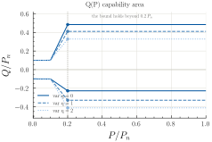
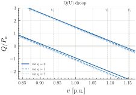
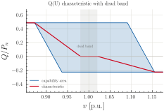
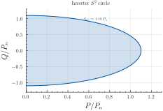
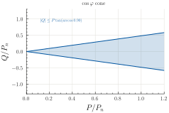
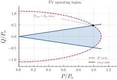
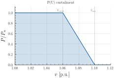
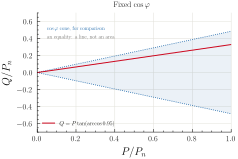
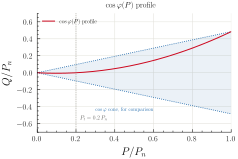

# Reactive-Power Control for PV and Wind

Grid codes (VDE-AR-N 4105 for LV, BDEW for MV) require distributed PV and wind
generators to regulate reactive power as a function of active output or local
voltage.  `potpourri` implements these constraints directly in the OPF
formulation so the solver explores the feasible (P, Q) region automatically.

Seven complementary constraint groups are available:

| Constraint | Symbol | Applies to |
|---|---|---|
| Q(P) characteristic | `PV_QP_pos/neg`, `sG_QP_pos/neg` | PV, wind (single- and multi-period) |
| Q(U) droop | `PV_QU_min/max`, `sG_QU_min/max` | PV, wind (single- and multi-period) |
| Inverter S² circle | `sgen_inverter_s2` | any sgen with `net.sgen.sn_mva` set |
| cos(φ) cone | `sgen_cos_phi_upper/lower` | sgens in `sGinv` (**requires the S² circle**) |
| P(U) curtailment | `sgen_pu_curtail` | any controllable PV sgen (AC only) |
| Fixed cos(φ) equality | `sgen_fixed_cos_phi` | any controllable sgen |
| cos(φ)(P) profile | `sgen_cpp` | any controllable sgen (NLP only) |

## Activation reference

Single- and multi-period models activate these constraints **differently**, and
a missing precondition is silent — no warning is raised, the constraint is
simply never added.  Check this table first when a constraint appears to have
no effect:

| Constraint | Single-period (`ACOPF.add_OPF`) | Multi-period (`ACOPF_multi_period.add_OPF`) |
|---|---|---|
| Q(P) / Q(U) | `pv_q_control="qp"` / `"qu"` / `"both"`, `net.sgen.var_q` set, **and** the sgen's `type` in `sgen_types` | automatic from `net.sgen.var_q` (no type filter) |
| Q(U) dead band | `qu_deadband=True` / `(v_lo, v_hi)` / a `QVCurve`, replacing the Q(U) area | same argument on `add_OPF`, model-wide |
| Inverter S² circle | `inverter_s2=True` **and** `net.sgen.sn_mva` present | automatic from `net.sgen.sn_mva` |
| cos(φ) cone | `inverter_s2=True` **and** `sn_mva` **and** a `cos_phi_min` value | automatic from `sn_mva` **and** `net.sgen.cos_phi_min` |
| P(U) curtailment | `pu_curtail=True` | automatic from `net.sgen.pu_curtail` |
| Fixed cos(φ) | `fixed_cos_phi=…` or `net.sgen.fixed_cos_phi` | automatic from `net.sgen.fixed_cos_phi` |
| cos(φ)(P) profile | `cos_phi_p_profile=True` **and** `net.sgen.cos_phi_min` | automatic from `net.sgen.cos_phi_p_profile` |

Two consequences worth calling out:

* **`inverter_s2` defaults to `False`** in the single-period model (it is
  opt-in, so that adding `sn_mva` to a network cannot silently change an
  existing model).  The multi-period model has no such flag — it enables the
  circle as soon as `sn_mva` is present.
* **The cos(φ) cone is nested inside the S² circle.**  Setting
  `net.sgen["cos_phi_min"]` alone does nothing; `inverter_s2=True` and a
  usable `sn_mva` are both required in the single-period model.

---

## Which sgens `pv_q_control` reaches

The single-period model additionally filters by the sgen `type` column.
Matching is **exact**, against `sgen_types` (default
`("PV", "PV_MV", "pv")` — the constant `DEFAULT_PV_SGEN_TYPES`).  This matters
because SimBench spells PV differently per voltage level — its RES dataset
uses `PV` in LV (and HV2), `PV_MV` in MV and lowercase `pv` in EHV — and
labels the aggregated LV renewables in MV grids `lv_RES`:

| SimBench grid | sgen types present | reached by default |
|---|---|---|
| `1-LV-rural1` | `PV` | 4 |
| `1-MV-rural` | `lv_RES`, `Wind_MV`, `Biomass_MV`, `PV_MV`, `Hydro_MV` | 2 |
| `1-MV-semiurb` | `lv_RES`, `Wind_MV`, `PV_MV`, … | 4 |
| `1-MV-urban` | `lv_RES`, `Hydro_MV` | **0** |
| `1-MV-comm` | `lv_RES`, `PV_MV`, `Wind_MV`, … | 5 |

Widen the selection when a study needs the other categories:

```python
opf.add_OPF(
    pv_q_control="both",
    sgen_types=("PV", "PV_MV", "pv", "lv_RES"),
)
```

Adding `lv_RES` raises the reach on the MV grids above from 2–5 units to
79–133, since it is by far the largest category there.  `1-MV-urban` has no
`PV_MV` at all, so it needs `lv_RES` listed explicitly before Q-control
applies to anything.

Wind categories are deliberately absent from that list — they belong to
`wind_sgen_types` (below), and listing them in both places triggers a
`SgenTypeOverlapWarning`.

!!! note "Medium-voltage grids and auxiliary buses"
    SimBench models every switch as a node-node switch, which inserts
    `auxiliary`-type nodes between busbars and the elements attached through
    them.  pandapower's ppc conversion therefore produces more buses than
    `net.bus` on those grids — 103 against 97 for `1-MV-rural--0-sw`.  The
    models account for this: `model.B` covers every ppc bus, while
    `model.Bpd` covers those backed by a pandapower bus, and voltage limits
    apply to `Bpd` because auxiliary nodes carry no user-supplied limits.
    SimBench's `no_sw` variant reduces its own auxiliary nodes (95 rather
    than 97 pandapower buses for `1-MV-rural`), but pandapower still
    derives the same number of auxiliary ppc buses either way, so `no_sw`
    does **not** avoid the issue.

### Wind uses a separate list

The wind Q-control path (`model.WIND` / `model.WINDc`) is selected
independently of `pv_q_control`, against `wind_sgen_types` (default
`("Wind", "Wind_MV", "wind onshore", "wind offshore")` — the constant
`DEFAULT_WIND_SGEN_TYPES` in `potpourri.technologies.q_control`).  SimBench
spells wind once per voltage level, so all four are needed:

| Spelling | Voltage level |
|---|---|
| `Wind` | HV |
| `Wind_MV` | MV |
| `wind onshore`, `wind offshore` | EHV |

Hosting-capacity units flagged via `net.sgen.wind_hc` are included regardless
of type.

Measured reach on the SimBench grids (`WINDc`, previously **0** everywhere
outside HV because only `Wind` matched):

| Grid | wind sgens | reached |
|---|---|---|
| `1-LV-rural1` | 0 | 0 |
| `1-MV-rural` | 6 | 6 |
| `1-MV-semiurb` | 5 | 5 |
| `1-MV-urban` | 0 | 0 |
| `1-MV-comm` | 3 | 3 |

!!! warning "Do not list wind categories in `sgen_types`"
    Both paths impose the same grid-code characteristic on the same `qsG`, so
    an sgen matching *both* lists would receive two redundant constraint sets.
    If that happens the model emits a `SgenTypeOverlapWarning`, names the
    affected sgens, and leaves them to the wind path — `PVc` gives them up.
    With the defaults the two lists are disjoint, so this cannot occur unless
    `sgen_types` is widened to include a wind category.

!!! note "The multi-period model applies no type filter"
    It keys purely off `var_q`, so it reaches every annotated sgen regardless
    of category.  Only the single-period model filters by `type`.

!!! danger "Fixed in 0.4.1 — multi-period Q-control did nothing"
    The multi-period reactive bounds `QsGmax` / `QsGmin` were derived from
    the `q_mvar` profile, which SimBench ships as **zero** for PV.  That
    pinned `qsG` to zero, so every multi-period Q-control constraint —
    Q(P), Q(U), the inverter circle — was satisfied trivially and **no
    reactive power was ever dispatched**.  The model looked Q-controlled
    and was not.

    The single-period path had always overridden those bounds from the
    capability table; the multi-period one now does the same.  Any
    multi-period Q-control result from 0.4.0 or earlier should be rerun.

    Sgens with `var_q` set take their reactive bounds from the grid code.
    Leave `var_q` as NaN on sgens that should keep profile-derived limits.

---

## Selecting a grid code

The technical connection rules (TAR) are represented as selectable
`GridCode` parameter sets in `potpourri.technologies.q_control`, so a study
can target the rule that applies to its voltage level:

| Grid code | Short name | Voltage level | `var_q` variants |
|---|---|---|---|
| VDE-AR-N 4105 | `"4105"` | low voltage | 2 |
| VDE-AR-N 4110 | `"4110"` | medium voltage | 1 |
| VDE-AR-N 4120 | `"4120"` | high voltage (110 kV) | 3 |

A `GridCode` carries two piecewise-linear capability areas — `pq_area`
(Q against active power) and `qv_area` (Q against voltage) — plus the P(U)
and cos(φ)(P) thresholds.  Every area reproduces the matching class in
pandapower's `DERController` to machine precision; the test suite asserts
it against pandapower's own `q_flexibility()`.

`var_q` selects a column of the capability table, so it must index a
variant the chosen code actually defines.  A value out of range, or a
fractional one, raises rather than being silently rounded to a neighbour.

Select a code model-wide:

```python
# Single-period
opf.add_OPF(pv_q_control="both", grid_code="4110")

# Multi-period (applies to every Q-controlled sgen in the model)
mpopf.add_OPF(grid_code="4110")
```

`grid_code` accepts `None` (VDE-AR-N 4120, the default), a short name
(`"4105"`, `"4110"`, `"4120"`, or the full `"VDE-AR-N 4110"`), or a
`GridCode` instance.  An unknown name raises `ValueError`.

!!! warning "The default changed meaning in 0.4.1"
    Before 0.4.1 the default was named `VDE_AR_N_4105` but held the
    **VDE-AR-N 4120** parameters: voltage breakpoints at 96 / 103 / 120 /
    127 kV on the 110 kV base, and the three 4120 variant pairs.  It is now
    named for the rule it actually encodes, and remains the default, so
    models that relied on those numbers are unchanged apart from the
    saturation fix below.

    `grid_code="4105"` now selects the **real** low-voltage rule: two
    variants at cos φ 0.95 and 0.90, breakpoints at 0.90–1.10 p.u.  If you
    were passing `"4105"` and want the previous numbers, pass `"4120"`.

    Every reactive limit in the registry corresponds to a round power
    factor the standards are written in — 0.90, 0.925, 0.95, 0.975 — which
    is checked in the test suite.

!!! note "VDE-AR-N 4130 (EHV) is not included"
    It needs `vn_kv`-dependent breakpoints for 380/220 kV and potpourri
    targets distribution grids.  Use pandapower's `PQVArea4130*` directly
    if you need it.

To add a further rule, construct a `GridCode` and register it:

```python
import numpy as np

from potpourri.technologies.q_control import (
    GRID_CODES,
    Envelope,
    GridCode,
)

MY_TAR = GridCode(
    name="my-tar",
    title="Operator TAR",
    voltage_level="medium voltage",
    # Q bounds against P/Pn: ramp to the full limit by 0.2 Pn, then hold.
    pq_area=Envelope(
        x_points=np.array([0.1, 0.2, 1.0]),
        q_min=np.array([[-0.1, -0.30, -0.30]]),
        q_max=np.array([[0.1, 0.30, 0.30]]),
    ),
    # Q bounds against voltage: hold, ramp, plateau, ramp, hold.
    qv_area=Envelope(
        x_points=np.array([0.90, 0.95, 1.05, 1.10]),
        q_min=np.array([[0.0, -0.30, -0.30, -0.30]]),
        q_max=np.array([[0.30, 0.30, 0.30, 0.0]]),
    ),
    vpu_v_curtail=1.06,
    vpu_v_max=1.10,
    cpp_p_threshold_pu=0.2,
)
GRID_CODES[MY_TAR.name] = MY_TAR
```

Both arrays are `(n_variants, n_points)`, so a code with three variants
carries three rows.  `Envelope` validates that the breakpoints ascend and
that `q_min <= q_max` everywhere.

!!! note "One grid code per model"
    The capability curves are computed once into a single table, so the
    grid code applies model-wide; per-sgen grid codes are not supported.

    Every path reads the registry, including the hosting-capacity wind path
    in `potpourri/technologies/windpower.py`. Its simplified HC check uses
    the widest envelope the selected code offers — the largest capacitive
    and most negative inductive entry, +0.484322 / −0.410775 for the
    default VDE-AR-N 4120.

---

## Background: VDE-AR-N 4105 Q-control modes

!!! note "The figures are generated, not drawn"
    Every curve on this page is computed from
    `potpourri.technologies.q_control` by
    `scripts/generate_qcontrol_figures.py`, so the figures cannot drift from
    the implementation — change a grid code and they change with it.
    Regenerate with `python scripts/generate_qcontrol_figures.py`
    (needs `matplotlib`, `rwthplots` and a LaTeX installation).


### Q(P) characteristic

Reactive power is bounded as a linear function of the installed active power
capacity *P*_n:

$$Q_{\min}(P) \;\le\; Q \;\le\; Q_{\max}(P)$$

$$Q_{\max}(P) = b^+_{\rm QP} \cdot P_n + m^+_{\rm QP} \cdot P$$

The bound is a **piecewise-linear envelope**, not a single line: it ramps
between the two active-power breakpoints and then holds at the variant's
limit.  For the default VDE-AR-N 4120 those breakpoints are 0.1 and
0.2 · *P*_n, and the envelope narrows to ±0.1 · *P*_n at the lower one:

| `var_q` | Q_max / P_n above 0.2·P_n | Q_min / P_n above 0.2·P_n | power factor |
|---|---|---|---|
| 0 | +0.484322 | −0.227902 | 0.90 / 0.975 |
| 1 | +0.410775 | −0.328684 | 0.925 / 0.95 |
| 2 | +0.328684 | −0.410775 | 0.95 / 0.925 |

Variant 0 is the widest capacitive envelope, variant 2 the widest inductive
one.  Each bound becomes one linear inequality per affine piece, so the
upper bound is the pointwise minimum of its pieces and the lower bound the
pointwise maximum.

!!! danger "Fixed in 0.4.1 — the bound used to run away"
    Before 0.4.1 both Q(P) and Q(U) were single **unclipped** lines: the
    saturation shelves the standards define were missing.  Q(P) reached
    **+3.52 · P_n** at rated output against a limit of +0.484, and the Q(U)
    band was **3.4× too wide at every voltage**, including nominal.  Models
    built with 0.4.0 or earlier permitted reactive dispatch far outside the
    grid code.

!!! note "Below the first breakpoint the model is deliberately permissive"
    The standard's area is non-convex there — it steps down to a narrow
    shelf — so it cannot be written as linear inequalities exactly.  Each
    bound is replaced by its hull over the operating range, which can only
    ever *widen* the feasible band, never narrow it.  For VDE-AR-N 4120 at
    *P* = 0.1 · *P*_n the model permits Q ∈ [−0.164, +0.292] where the
    standard requires only ±0.1.  It is exact from the reference point
    (0.2 · *P*_n) to rated output.

    The alternative — extrapolating the end segment — made the two bounds
    cross, so that **no** reactive power at all was feasible below
    *P* = 0.061 · *P*_n.  That was the behaviour up to 0.4.0, and any
    curtailed sgen made the model infeasible.




*The area permitted by Q(P), for each `var_q` variant. The bound ramps
between the two breakpoints and then holds — the flat shelf beyond
0.2·P_n is the saturation that was missing before 0.4.1.*

### Q(U) droop

Reactive power is bounded as a linear function of the per-unit bus voltage *v*:

$$Q_{\min}(v) \;\le\; Q \;\le\; Q_{\max}(v)$$

$$Q_{\max}(v) = b^+_{\rm QU} + m^+_{\rm QU} \cdot v$$

As with Q(P), the bound is a piecewise-linear envelope.  It forms a hexagon
over the code's four voltage breakpoints: pinned to the capacitive limit
below *V*₁, opening out across *V*₁–*V*₂, spanning the full range over the
plateau *V*₂–*V*₃, closing again across *V*₃–*V*₄ and pinned to the
inductive limit above *V*₄.

For VDE-AR-N 4120 the breakpoints are 96 / 103 / 120 / 127 kV on the 110 kV
base, so the span reaches 0.87–1.15 p.u. rather than the 0.90–1.10 of the
LV and MV rules.



*The area permitted by Q(U) across the code's own breakpoints V1–V4. The
band slopes downward overall: at low voltage the unit may inject reactive
power, at high voltage it must absorb — but it saturates at both ends
instead of running on.*

### Q(U) with a dead band

The area above **bounds** Q and leaves the optimiser free inside it.  A real
Q(U) droop controller instead **assigns** Q from voltage, following a
characteristic — and that is what makes a *dead band* expressible: a
voltage span around nominal over which Q is held at zero.



*The characteristic (red) inside the capability area (blue). Q is pinned to
zero across the dead band and ramps to the code's reactive limits outside
it.*

Enable it with `qu_deadband`, which replaces the Q(U) area with the
characteristic:

```python
# The grid code's own QV plateau becomes the dead band
opf.add_OPF(pv_q_control="both", qu_deadband=True)

# Or set it explicitly
opf.add_OPF(pv_q_control="both", qu_deadband=(0.98, 1.02))

# Multi-period, model-wide
mpopf.add_OPF(qu_deadband=(0.98, 1.02))
```

You can also build the curve yourself and pass it:

```python
from potpourri.technologies.q_control import VDE_AR_N_4110

curve = VDE_AR_N_4110.deadband_curve(deadband=(0.97, 1.03))
mpopf.add_OPF(grid_code="4110", qu_deadband=curve)
```

!!! warning "This needs a MIP-capable solver"
    Pinning Q to a curve that is flat at zero makes the feasible set pinch
    to a point, which is **not convex**.  The constraint is built with
    `pyomo.Piecewise` and introduces binary variables, so IPOPT alone
    cannot solve it.

    Use `gurobi_direct_minlp` (Gurobi 12+, whose nonlinear API handles the
    AC power flow's trigonometric terms) — it solves the models on this
    page in about a second.  MindtPy's outer approximation is *unsound* on
    non-convex nonlinear equalities such as the AC power flow: it can
    report `infeasible` for a model that is demonstrably feasible, so do
    not trust a negative result from it here.

!!! note "The dead band is a parameterisation, not a normative value"
    Where the dead band sits is set by the network operator.  The default
    reproduces the plateau of the selected code's QV area; pass an explicit
    pair to set it.

## Inverter operating region for PV generators

The (P, Q) feasible region for a PV grid-forming inverter is the intersection
of three constraints — a "pizza slice" in the P-Q plane:

1. **P ≥ 0** — solar panels only produce active power.
2. **S² circle** — apparent power is bounded by the inverter rating
   S_inv = s_n × converter_sizing:
   $$P^2 + Q^2 \;\le\; S_{\rm inv}^2$$
3. **cos(φ) cone** — the power factor stays above a minimum value
   cos(φ_min):
   $$|Q| \;\le\; P \cdot \tan\!\bigl(\arccos(\cos\varphi_{\min})\bigr)$$

The crossover between the cone and the circle occurs at
*P*_cross = S_inv · cos(φ_min).  For *P* > *P*_cross the S² circle
is binding; for *P* < *P*_cross the cone is binding.

**Contrast with battery inverters:** battery storage operates in all four
quadrants (P and Q both positive or negative), so only the S² circle applies.
The circle for batteries is already added automatically via
`Basemodel.add_storage()`.

---




*The apparent-power circle alone. It bounds the magnitude of (P, Q) but permits
any power factor, including pure reactive injection at P = 0.*



*The cos(φ) cone alone. It bounds the ratio of Q to P but not their magnitude —
the wedge is unbounded, so the cone by itself permits arbitrarily large output.*



*Both together with P ≥ 0 give the actual operating region. The cone binds
below the crossover at P = S_inv·cos(φ); the circle binds above it. Neither
constraint alone produces this shape.*

## P(U) active-power curtailment (VDE-AR-N 4105 §8.5)

When bus voltage exceeds a threshold, the inverter reduces active output
linearly to zero:

$$P \;\le\; P_n \cdot \frac{V_{\max} - v[b]}{V_{\max} - V_{\rm curtail}}$$

Default thresholds: *V*_curtail = 1.06 p.u., *V*_max = 1.10 p.u.

The constraint is bilinear in P and v[b] — requires an NLP solver (IPOPT).

---




*Permitted active power against bus voltage. Output is unrestricted up to
V_curtail, then falls linearly to zero at V_max. This constrains active, not
reactive, power — which is why it may be combined with a Q rule.*

## Fixed cos(φ) mode

An equality constraint that fixes the reactive-to-active ratio at every
operating point:

$$Q[g] = P[g] \cdot \tan(\arccos(\cos\varphi))$$

Unlike the cos(φ) cone (which is a bound), this is an equality: the
inverter tracks the prescribed power factor exactly.

---




*Fixed cos(φ) is an equality, so the operating area collapses to a line: Q is
pinned to P rather than bounded by it. The cos(φ) cone is shown dotted for
comparison — that is the area a bound of the same power factor would permit.*

## cos(φ)(P) profile (VDE-AR-N 4105)

A piecewise P-Q curve: no reactive power below a threshold *P*_t, then Q
increases with P up to the target power factor at full output:

$$Q \cdot (P_n - P_t) = \tan(\varphi) \cdot P \cdot (P - P_t)$$

Implemented as a quadratic equality (NLP). Q → 0 at P = 0 or P = P_t;
Q_max = P_n · tan(φ) at P = P_n.

Default threshold: *P*_t = 0.2 · P_n.

---




*The cos(φ)(P) profile is also an equality, so it is likewise a locus rather
than an area. Q stays at zero until P_t, then rises quadratically to meet the
cone at full output.*

## Single-period usage

### Enabling Q-control modes

Annotate the network sgens with `var_q` (variant index) and `p_inst_mw`
(installed capacity) before building the model:

```python
import simbench as sb
from potpourri.models.ACOPF_base import ACOPF

net = sb.get_simbench_net("1-LV-rural1--0-sw")

# Mark PV sgens with Q-control variant 0 (Qmax = 0.484322 Pn)
net.sgen["var_q"] = None       # object-dtype column; None for non-PV rows
mask = net.sgen["type"] == "PV"
net.sgen.loc[mask, "var_q"] = 0
net.sgen["p_inst_mw"] = net.sgen["p_mw"].abs()   # installed capacity

net.sgen["controllable"] = True
net.bus["max_vm_pu"] = 1.05
net.bus["min_vm_pu"] = 0.95
```

Pass `pv_q_control` to `add_OPF()` to select the control mode:

```python
opf = ACOPF(net)

# Mode options:
#   None      — no Q-control (default)
#   "qp"      — Q(P) characteristic only
#   "qu"      — Q(U) droop only
#   "both"    — Q(P) + Q(U) combined  (also accepts True for backward compat.)
opf.add_OPF(pv_q_control="both")
opf.add_voltage_deviation_objective()
opf.solve(solver="ipopt")
```

### Enabling the inverter S² circle

Set `net.sgen.sn_mva` (apparent-power rating) and optionally
`net.sgen.converter_sizing_pu` (default 1.0) before constructing the model,
then pass `inverter_s2=True` explicitly — the flag is opt-in and defaults to
`False`:

```python
net.sgen["sn_mva"] = net.sgen["p_mw"].abs() / 0.9   # 90 % power factor rating
net.sgen["converter_sizing_pu"] = 1.0                # no derating

opf = ACOPF(net)
opf.add_OPF(inverter_s2=True)
```

### Enabling P(U) curtailment

Set `net.sgen["p_inst_mw"]` and optionally per-sgen voltage thresholds,
then pass `pu_curtail=True`:

```python
net.sgen["p_inst_mw"] = net.sgen["p_mw"].abs()
net.sgen["v_curtail_pu"] = 1.06      # optional; defaults to 1.06
net.sgen["v_max_curtail_pu"] = 1.10  # optional; defaults to 1.10

opf = ACOPF(net)
opf.add_OPF(pu_curtail=True)         # applies to PV-type sgens in sGc
```

### Enabling fixed cos(φ) mode

```python
# Scalar: same power factor for all controllable sgens
opf.add_OPF(fixed_cos_phi=0.95)

# Per-sgen: set net.sgen["fixed_cos_phi"] column (takes precedence)
net.sgen["fixed_cos_phi"] = 0.95
opf.add_OPF()
```

### Enabling the cos(φ)(P) profile

```python
net.sgen["cos_phi_min"] = 0.9        # power factor at full output
net.sgen["p_inst_mw"] = net.sgen["p_mw"].abs()
# net.sgen["cpp_p_threshold_pu"] = 0.2  # optional; default 0.2

opf.add_OPF(cos_phi_p_profile=True)
```

### Enabling the cos(φ) cone

The cone is added *inside* the S² circle block, so `inverter_s2=True` and a
usable `net.sgen.sn_mva` are required in **both** forms below.  Setting
`cos_phi_min` without `inverter_s2=True` adds no constraint and raises no
warning.

```python
net.sgen["sn_mva"] = net.sgen["p_mw"].abs() / 0.9   # required

# Per-sgen (different limits per generator) — column takes precedence
net.sgen["cos_phi_min"] = 0.9
opf.add_OPF(inverter_s2=True)

# Or a scalar for every sgen in sGinv, when no column is present
opf.add_OPF(inverter_s2=True, cos_phi_min=0.9)
```

Both forms create `model.sgen_cos_phi_upper/lower` over set `model.sGpf`.  To
confirm the cone was actually built:

```python
assert hasattr(opf.model, "sgen_cos_phi_upper")
```

In the multi-period model no flag is needed — `sn_mva` plus `cos_phi_min` in
`net.sgen` is sufficient.

---

## OLTC tap optimisation (multi-period)

The multi-period model supports continuous OLTC optimisation via
`add_tap_changer_linear()`, which unfixes the time-indexed `Tap[tr, t]`
variable and adds per-step bounds:

```python
mpopf = ACOPF_multi_period(net, toT=96)
mpopf.add_OPF()

# Continuous OLTC — free within [tap_min, tap_max] each step
mpopf.add_tap_changer_linear()

# With optional inter-step rate limit (Δtap ≤ 0.01 per 15 min)
mpopf.add_tap_changer_linear(max_tap_change_per_step=0.01)

mpopf.add_voltage_deviation_objective()
mpopf.solve(solver="ipopt")
```

For discrete tap positions (MIP solver required):

```python
mpopf.add_tap_changer_discrete()
mpopf.solve(solver="mindtpy", mip_solver="gurobi")
```

---

## Multi-period usage

In `ACOPF_multi_period` the Q-control constraints are added automatically from
the network data — no extra keyword argument is needed.

```python
import copy
import simbench as sb
from potpourri.models_multi_period.ACOPF_multi_period import ACOPF_multi_period

net = sb.get_simbench_net("1-LV-rural1--0-sw")

# Annotate sgens as above (var_q, p_inst_mw, sn_mva, cos_phi_min)
net.sgen["var_q"] = None
mask = net.sgen["type"] == "PV"
net.sgen.loc[mask, "var_q"] = 0
net.sgen["p_inst_mw"] = net.sgen["p_mw"].abs()
net.sgen["sn_mva"] = net.sgen["p_mw"].abs() / 0.9
net.sgen["cos_phi_min"] = 0.9

net.sgen["max_p_mw"] = net.sgen["p_mw"]
net.sgen["min_p_mw"] = 0.0
net.bus["max_vm_pu"] = 1.05
net.bus["min_vm_pu"] = 0.95

mpopf = ACOPF_multi_period(net, toT=13848, fromT=13824)
mpopf.add_OPF()
mpopf.add_voltage_deviation_objective()
mpopf.solve(solver="ipopt")
```

`_calc_opf_parameters()` detects `var_q` in `net.sgen` and calls
`static_generation_q_ctrl_data()` and `static_generation_inverter_data()`
automatically.

### Selecting an inverter controller mode

The three inverter controller modes are **alternatives** — pick one per study.
Each is activated by its own `net.sgen` column:

```python
# (a) P(U) curtailment — boolean column
net.sgen.loc[mask, "pu_curtail"] = True

# (b) Fixed cos(φ) — per-sgen float column
net.sgen.loc[mask, "fixed_cos_phi"] = 0.95

# (c) cos(φ)(P) profile — boolean column + cos_phi_min
net.sgen.loc[mask, "cos_phi_p_profile"] = True
net.sgen.loc[mask, "cos_phi_min"] = 0.9
```

!!! warning "Do not stack the equality modes"
    Fixed cos(φ) (b) and the cos(φ)(P) profile (c) are both **equality**
    constraints on the same `qsG[g, t]`.  Setting both columns on the same
    sgens builds `sgen_fixed_cos_phi` *and* `sgen_cpp` simultaneously, which
    over-determines reactive power and typically leaves the model infeasible
    or numerically degenerate.  Combining either equality mode with the Q(P)
    envelope is likewise over-constrained, since Q is then pinned by the
    equality and can no longer move within the grid-code band.

    `scripts/q_control_opf.py` shows the intended pattern: solve each mode
    against its own copy of the network and compare the results.

Adding P(U) curtailment (a) *alongside* Q-control is fine — it constrains
active rather than reactive power.

---

## Pyomo components reference

### Single-period (ACOPF)

| Component | Type | Description |
|---|---|---|
| `model.PVc` | Set | Controllable PV sgen indices |
| `model.PV_var_q[g]` | Param | Q-control variant (0–2) |
| `model.PV_p_inst[g]` | Param | Installed capacity P_n (p.u.) |
| `model.qPV[g]` | Var | PV reactive dispatch (p.u.) |
| `model.PV_QP_pos[g]` | Constraint | Q ≤ Q_max(P) upper bound |
| `model.PV_QP_neg[g]` | Constraint | Q ≥ Q_min(P) lower bound |
| `model.PV_QU_min[g]` | Constraint | Q ≥ Q_min(v) lower bound |
| `model.PV_QU_max[g]` | Constraint | Q ≤ Q_max(v) upper bound |
| `model.sGinv` | Set | sgen indices with inverter ratings |
| `model.S_inv[g]` | Param | Inverter apparent-power limit S_inv (p.u.) |
| `model.sgen_inverter_s2[g]` | Constraint | P² + Q² ≤ S_inv² |
| `model.sGpf` | Set | sgen indices with cos(φ) limits |
| `model.tan_phi[g]` | Param | tan(arccos(cos_phi_min)) |
| `model.sgen_cos_phi_upper[g]` | Constraint | Q ≤ P · tan(φ) |
| `model.sgen_cos_phi_lower[g]` | Constraint | Q ≥ −P · tan(φ) |
| `model.sGpu` | Set | PV sgens with P(U) curtailment |
| `model.P_inst_pu[g]` | Param | Installed capacity P_n (p.u.) |
| `model.V_curtail[g]` | Param | Curtailment threshold voltage (p.u.) |
| `model.V_max_curtail[g]` | Param | Zero-output voltage (p.u.) |
| `model.sgen_pu_curtail[g]` | Constraint | P · ΔV ≤ P_n · (V_max − v[b]) |
| `model.sGfcf` | Set | sgen indices with fixed cos(φ) |
| `model.fixed_tan_phi[g]` | Param | tan(arccos(fixed_cos_phi)) |
| `model.sgen_fixed_cos_phi[g]` | Constraint | Q == tan_phi · P |
| `model.sGcpp` | Set | sgen indices with cos(φ)(P) profile |
| `model.cpp_tan_phi[g]` | Param | tan_phi at full output |
| `model.cpp_Pn[g]` | Param | Installed capacity P_n (p.u.) |
| `model.cpp_P_thresh[g]` | Param | Threshold P_t = P_thresh_pu · P_n |
| `model.sgen_cpp[g]` | Constraint | Q·(Pn−Pt) == tan_phi·P·(P−Pt) |

### Multi-period (ACOPF_multi_period via Sgens_multi_period)

The time-indexed variants use `[g, t]` indices:

| Component | Description |
|---|---|
| `model.sGqc` | Set of Q-controlled sgen indices |
| `model.sG_QP_pos[g, t]` | Q ≤ Q_max(P) upper bound |
| `model.sG_QP_neg[g, t]` | Q ≥ Q_min(P) lower bound |
| `model.sG_QU_min[g, t]` | Q ≥ Q_min(v) lower bound |
| `model.sG_QU_max[g, t]` | Q ≤ Q_max(v) upper bound |
| `model.sgen_inverter_s2[g, t]` | P² + Q² ≤ S_inv² |
| `model.sgen_cos_phi_upper[g, t]` | Q ≤ P · tan(φ) |
| `model.sgen_cos_phi_lower[g, t]` | Q ≥ −P · tan(φ) |
| `model.sgen_pu_curtail[g, t]` | P · ΔV ≤ P_n · (V_max − v[b,t]) |
| `model.sgen_fixed_cos_phi[g, t]` | Q == tan_phi · P |
| `model.sgen_cpp[g, t]` | Q·(Pn−Pt) == tan_phi·P·(P−Pt) |

---

## Assigning a different strategy per sgen

The grid code applies model-wide, but *which controller each sgen follows* is
per-row.  In the multi-period model every strategy is driven by a `net.sgen`
column, so units on the same feeder can follow different rules:

```python
net.sgen["var_q"] = None
net.sgen["fixed_cos_phi"] = float("nan")
net.sgen["cos_phi_p_profile"] = False
net.sgen["cos_phi_min"] = float("nan")
net.sgen["pu_curtail"] = False

net.sgen.at[0, "var_q"] = 0                  # Q(P) + Q(U) envelope
net.sgen.at[1, "fixed_cos_phi"] = 0.95       # fixed power factor
net.sgen.at[2, "cos_phi_p_profile"] = True   # cos(φ)(P) profile
net.sgen.at[2, "cos_phi_min"] = 0.90
net.sgen.at[3, "pu_curtail"] = True          # P(U) curtailment
net.sgen.at[3, "var_q"] = 0                  # …may combine with a Q rule

mpopf = ACOPF_multi_period(net, toT=24)
mpopf.add_OPF(grid_code="4105")
```

Two rules for combining strategies on one sgen:

* **Fixed cos(φ) and the cos(φ)(P) profile must not share an sgen.** Both are
  equality constraints on the same `qsG`, so together they over-determine
  reactive power and the model is typically infeasible or degenerate. Keep
  them on disjoint sets.
* **P(U) curtailment may be combined with a Q rule**, because it constrains
  active rather than reactive power.

!!! note "Per-row assignment is a multi-period feature"
    In the single-period model `pu_curtail` and `cos_phi_p_profile` are
    model-wide switches on `add_OPF()`, so only `fixed_cos_phi` and `var_q`
    can vary per row there. Use the multi-period model when the study needs
    genuinely mixed controllers.

### What a mixed assignment looks like

A fixed power factor couples Q rigidly to P. When the feeder already sits
above 1.0 p.u. and the objective penalises voltage deviation, the only way
for such a unit to shed reactive power is to shed active power — so it
curtails, while its Q(P)/Q(U) neighbours keep producing. That coupling is the
practical cost of a fixed power factor, and it is the usual reason to prefer
the bound-type rules when active yield matters.

---

## Example scripts

`scripts/grid_code_q_strategies.py` covers this page's two selection
mechanisms:

1. **Grid-code selection** — solves one snapshot under every registered grid
   code and reports the capability envelope, objective and voltage band for
   each, surfacing the `ProvisionalGridCodeWarning` for VDE-AR-N 4110 rather
   than silencing it.
2. **One strategy per sgen** — assigns Q(P)/Q(U), fixed cos(φ), cos(φ)(P) and
   P(U) curtailment to different PV units, reports which constraint blocks
   were built, and prints the resulting per-sgen dispatch.

`scripts/q_control_opf.py` demonstrates both use cases:

1. **Single-period comparison** — solves four modes side-by-side
   (uncontrolled, Q(P) only, Q(U) only, Q(P)+Q(U)) and prints an objective /
   voltage-band summary and a per-sgen Q dispatch table with Q(P) bound
   verification.

2. **Multi-period 24-step run** — shows how `ACOPF_multi_period` picks up
   `var_q` automatically and reports a P/Q time series for the first
   Q-controlled sgen.

See [Scripts reference](../scripts/examples.md) for the full list of
runnable examples.
